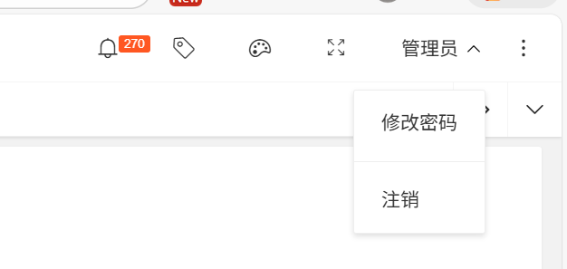
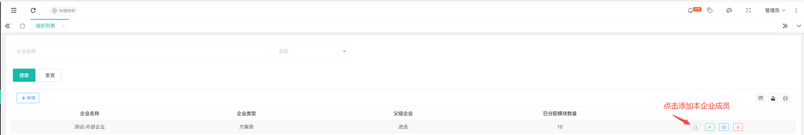
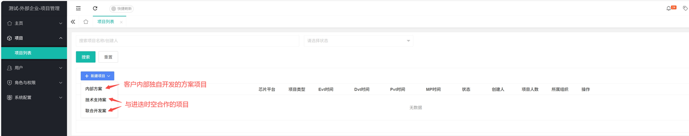
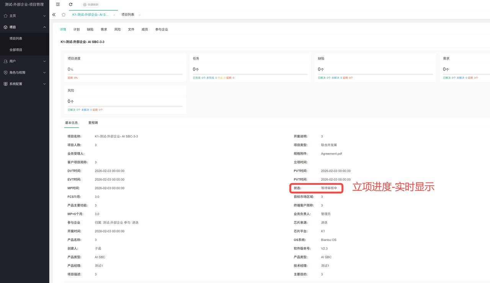
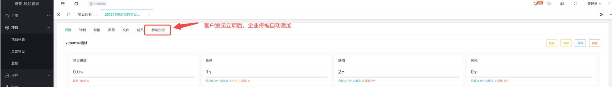
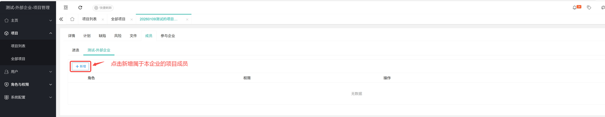
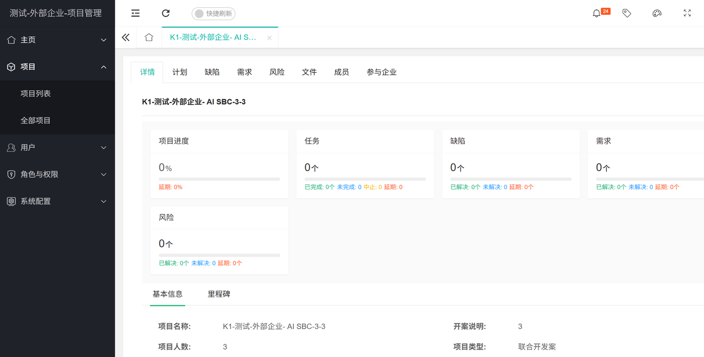
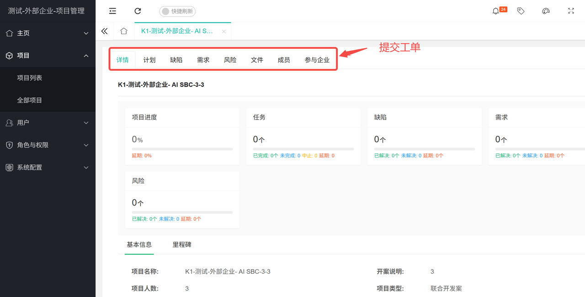

sidebar_position: 1

# 进迭时空客户项目管理服务平台

进迭时空客户项目管理服务平台主要面向所有进迭时空芯片的代理商、方案商以及渠道合作伙伴、企业开发者，提供在线技术支持服务。

> **注：** 目前仅向与进迭时空合作的企业开放，暂未面向个人开发者群体。

## 企业认证

### 注册账号

每个企业限定一个主账号。

- 首次使用，请联系与您对接的进迭时空业务负责人获取账号密码。
- 老客户可直接用账号登录。

获取账号之后，为了您的信息安全，请及时点击右上角个人中心“修改密码”。

### 获得NDA认证

请联系与您对接的进迭时空业务负责人，获取NDA协议。
- [进迭时空-（单向）保密协议模板-20230625](https://cdn-resource.spacemit.com/file%2Fservice%2F%E8%BF%9B%E8%BF%AD%E6%97%B6%E7%A9%BA-%EF%BC%88%E5%8D%95%E5%90%91%EF%BC%89%E4%BF%9D%E5%AF%86%E5%8D%8F%E8%AE%AE%E6%A8%A1%E6%9D%BF-20230625.docx)
- [进迭时空-（双向）保密协议模板-20230625](https://cdn-resource.spacemit.com/file%2Fservice%2F%E8%BF%9B%E8%BF%AD%E6%97%B6%E7%A9%BA-%EF%BC%88%E5%8F%8C%E5%90%91%EF%BC%89%E4%BF%9D%E5%AF%86%E5%8D%8F%E8%AE%AE%E6%A8%A1%E6%9D%BF-20230625.docx)

### 添加企业成员

企业管理员账号可操作添加本企业成员账号。

## 项目立项

左侧菜单栏点击项目列表，选择“新建项目-联合开发案”

- 内部方案：贵司内部独立开发，未与进迭时空合作的项目
- 技术支持案：进迭时空为贵司提供技术支持的项目
- 联合开发案：贵司与进迭时空合作开发的项目

### 查看立项进度

提交申请后，您可点击进入项目详情查看审核进度。

### 添加企业进项目组

客户发起立项之后，系统会自动将客户企业添加进入项目组。可在点击进入项目，在详情页点击“企业”查看。
如贵企业未被自动添加进项目组，请联系与您对接的进迭时空业务负责人。

### 添加项目组成员

您可在项目详情页点击“成员”，添加属于本企业的项目组成员。

### 查看项目详情

项目 -> 项目列表：可查看项目信息、里程碑，以及计划、缺陷、需求、风险、成员、企业等详细信息。

## 工单提交

已成功立项的项目，可在项目详情-缺陷、需求等模块提交工单。
工单提交后，由FAE评估指派给工程师，支持问题流转。

## 技术服务

左侧菜单栏点击项目列表，选择“新建项目-技术支持案”

- 内部方案：贵司内部独立开发，未与进迭时空合作的项目
- 技术支持案：进迭时空为贵司提供技术支持的项目
- 联合开发案：贵司与进迭时空合作开发的项目

提交申请后，您可点击进入项目详情查看审核进度。
立项成功后，您可在项目中添加企业、添加项目组成员、提交工单。详见文内 [项目立项](#项目立项)、[工单提交](#工单提交)。
